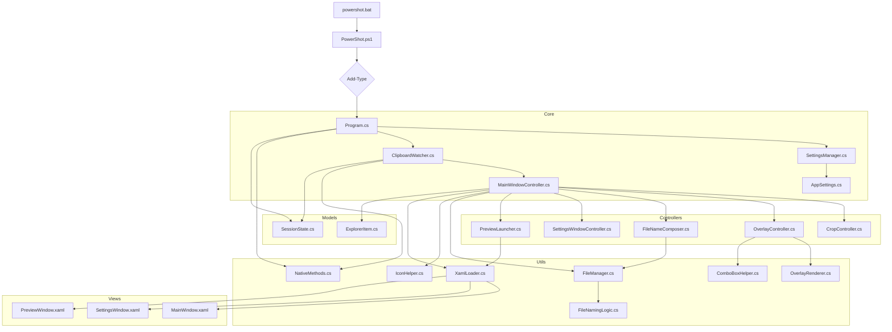

# Project Dependencies & Architecture

PowerShot v3.2 は、PowerShell をランチャーとし、C# (WPF) をインメモリでコンパイル・実行するハイブリッド・アーキテクチャを採用しています。

## 1. 全体構成図

## 2. 依存関係の定義

### 2.1 エントリーポイント
| ファイル | 役割 | 依存先 |
| :--- | :--- | :--- |
| `powershot.bat` | 実行用バッチファイル | `PowerShot.ps1` |
| `PowerShot.ps1` | アセンブリのロード、C# ソースのコンパイル、実行開始 | `src/` 配下の全 `.cs` ファイル |

### 2.2 コア・ロジック
| ファイル | 役割 | 依存先 |
| :--- | :--- | :--- |
| `Program.cs` | アプリケーションの初期化、ライフサイクル管理 | `ClipboardWatcher`, `SettingsManager`, `SessionState`, `NativeMethods` |
| `ClipboardWatcher.cs` | クリップボード更新およびホットキーの監視 | `MainWindowController`, `NativeMethods`, `XamlLoader`, `AppSettings`, `SessionState` |

### 2.3 UI コントローラー
| ファイル | 役割 | 依存先 |
| :--- | :--- | :--- |
| `MainWindowController.cs` | メイン画面の挙動、ファイル操作、プレビュー制御 | `CropController`, `OverlayController`, `FileNameComposer`, `SettingsWindowController`, `PreviewLauncher`, `FileManager`, `IconHelper`, `XamlLoader`, `OverlayRenderer`, `ExplorerItem` |
| `CropController.cs` | プレビュー画像上のトリミング範囲選択ロジック | - |
| `OverlayController.cs` | テキスト・システム情報の重畳設定管理 | `OverlayRenderer`, `ComboBoxHelper` |
| `FileNameComposer.cs` | 保存ファイル名の自動生成・連番管理 | `SequenceManager`, `FileManager` |
| `SettingsWindowController.cs` | 設定画面のロジック | `AppSettings` |
| `PreviewLauncher.cs` | 既存ファイルのプレビュー表示 | `XamlLoader` |

### 2.4 ユーティリティ & モデル
| ファイル | 役割 | 依存先 |
| :--- | :--- | :--- |
| `NativeMethods.cs` | Windows API (P/Invoke) の定義 | Win32 API |
| `FileManager.cs` | 画像の保存 (JPEG/PNG)、フォルダバリデーション | `FileNamingLogic`, `System.Drawing` |
| `FileNamingLogic.cs` | ファイル名の生成規則、禁則文字チェック | - |
| `OverlayRenderer.cs` | GDI+ を使用した画像へのテキスト描画 | `System.Drawing` |
| `XamlLoader.cs` | ランタイムでの XAML ファイル読み込み | `PresentationFramework` |
| `ComboBoxHelper.cs` | ComboBox の Tag ベース選択ヘルパー | - |
| `SettingsManager.cs` | `settings.json` のロード/保存ロジック | `AppSettings`, `DataContractJsonSerializer` |
| `AppSettings.cs` | `settings.json` のデータ構造定義 | `System.Runtime.Serialization` |
| `SessionState.cs` | 前回のディレクトリ、現在の連番など実行時状態の保持 | - |
| `ExplorerItem.cs` | エクスプローラーリストのアイテムモデル | - |

## 3. HTML Viewer (独立ツール)
| ファイル | 役割 | 依存先 |
| :--- | :--- | :--- |
| `powershot-viewer.bat` | ビューワー起動バッチ | `Viewer.ps1` |
| `Viewer.ps1` | ビューワー生成エンジンの起動 | `ViewerController.cs` |
| `ViewerController.cs` | スクリーンショット一覧を HTML として書き出し | `viewer_template.html`, `ViewerModels.cs` |
